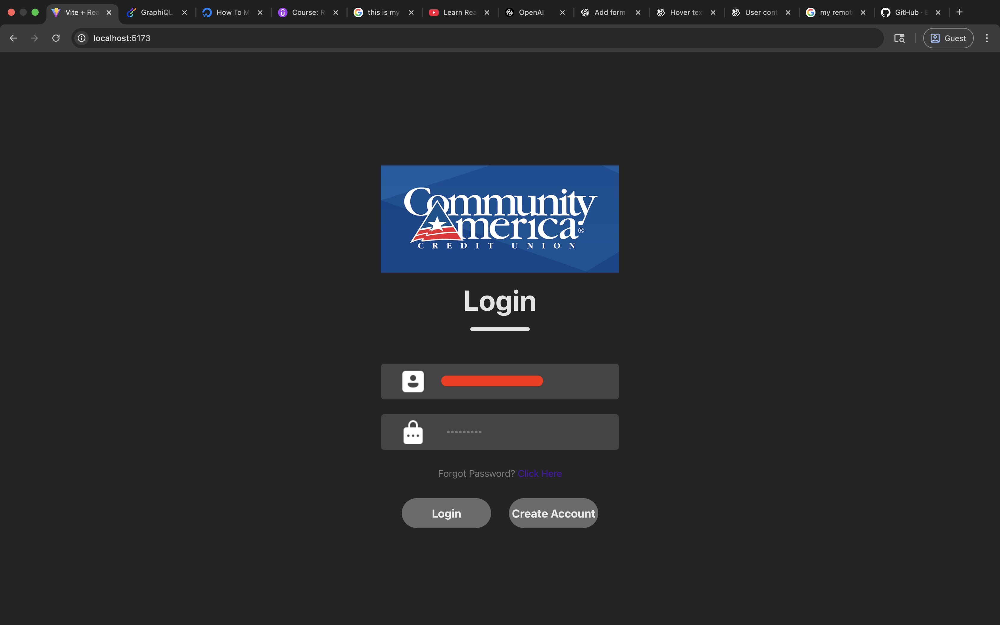

# react-graphql-app

This is a react app where data of CommunityAmerica.com is fetched from Optimizely's Graphql server using Apollo client and displayed on pages.

- **_Main.tsx_** : Entrypoint of the app. It has the config for setting up the client including security API_KEY required to connect to Optimizely's GraphQl server.

- **_App.tsx_** : Main routing page where the routes of all the pages are managed. The main page being the login page with "/" path. It also has a UserProvider wrapped on top of all the routes to make sure that the User Context i.e user data is available and passed across all the pages of the website.

- **_components_** : Directory that contains functional components for advisor listing, news listing, customer segments, login signup and also hooks that are nothing but inidividual services to fetch data from Optimizely Data Platform (ODP) and so on.

  1. **_Advisor Listing:_** Financial Advisor info is fetched here.
  2. **_News Listing:_** News info is fetched here.
  3. **_Customer Segments:_** Customer segments are fetched here. First, we fetch all the customer segments and then we pass these segments to as paramaters to a query which fetches custom segments that a customer belongs to.
  4. **_Header:_** Navbar data to access all the links.
  5. **_Home:_** Dashboard page that a user sees after successful login.
  6. **_LoginSignup:_** Contains code for Login and Signup page. It has form validations present to make sure login form is not submitted without entering input field values.
  7. **_Logout:_** Contains code for Logout page.
  8. **_hooks:_** Contains hooks that are nothing but services that execute graphql queries and fetch segments data, image data and so on.

- **_graphql_** : Directory that contains graphql queries for advisor listing, news listing, ODP segments and customer(user) segments.

- **_shared_** : Contains ApolloClient config. Since we are fetching data from Graphql Server for advisor and news listing as well as Optimizely Data Platform (ODP) for customer segments, the client config is maintained here so that these configs can be interchangeably used for different queries depending upon where the data needs to be fetched from.

- **_store_** : Contains UserContext. We are using user context so as to have user information available across all web pages. It is made available by creating UserProvider that wraps the app in app.tsx.

- **_vite.config.ts_** Contains the vite config of the project. Also contains backend proxy configuration required to fetch response from ODP.

### NOTE:

#### Fetching data from Graphql Server

In order to use the apollo client successfully to fetch the data using CACU's optimizely graph, please enter a valid key in place of {API_KEY} in shared/ApolloClients.tsx file's OptiGraphqlClient config's uri section.

#### Fetching data from ODP

ODP doesn't support direct querying of data like graphql using api key. It has a CORS policy which doesn't allow response to be sent to client. The workaround done for this was to use a backend proxy that would serve as a server and would make a server request to the target ODP url so that CORS policy can be circumvented and appropriate response can be received. In order to do that though, vite.config.ts file needs to be updated with the ODP API key by adding it to 'x-api-key' header.

### SIDE-NOTE:

I have another project 'graphql-server' that runs the graphql server. It runs locally on port 4000 hence can be accessed by http://localhost:4000/graphql.
Our Graphql client can be configured to point to that url in case you want to test custom graphql server. There exists a _backup.tsx_ file which has code to fetch a simple book data from this graphql server. This is just for testing purpose. The backup.tsx is not related to the project otherwise.

### TODO:

Using a code generation tool, a generated.ts file can be created that defines TypeScript types corresponding to GraphQL interfaces, facilitating type-safe development and schema alignment.

### SCREENSHOTS:

Login

Signup

Login Validations

Home for user that belongs to segment "test_segment"

User segments for user that belongs to segment "test_segment"

Home for user that does not belong to segment "test_segment"

User segments for user that does not belong to segment "test_segment"

Advisor Listing

News Listing

Logout

